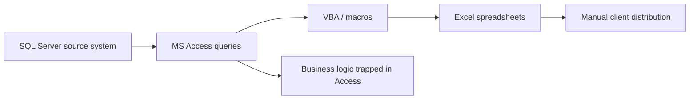
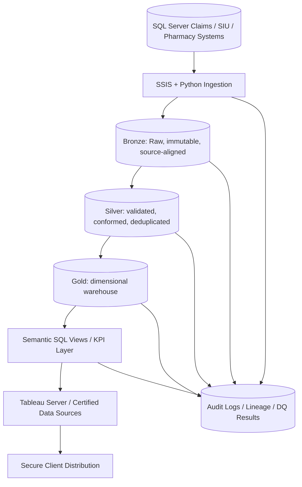
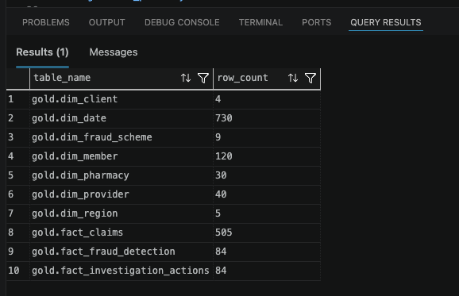
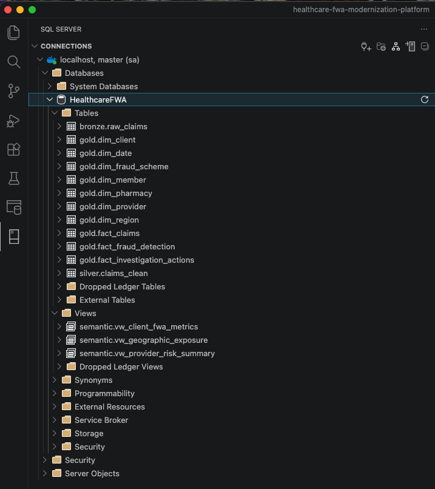
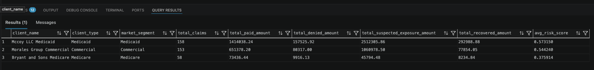
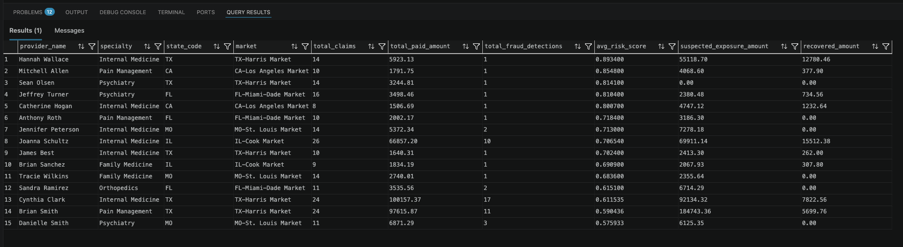
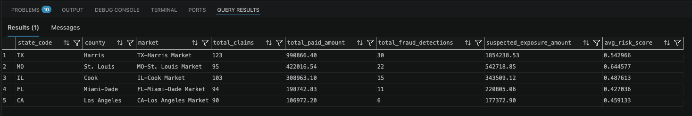

# Healthcare FWA Modernization Platform

Enterprise-grade reference repository for modernizing a legacy healthcare Fraud, Waste, and Abuse reporting ecosystem from:

```text
SQL Server → MS Access → Excel Spreadsheets → Manual Client Distribution
```

to a governed, secure, auditable, automated analytics platform:

```text
SQL Server Source Systems
        ↓
SSIS + Python Ingestion
        ↓
Bronze Raw Landing
        ↓
Silver Conformed & Validated Data
        ↓
Gold Dimensional Warehouse
        ↓
Semantic Views / KPI Layer
        ↓
Tableau Server / Embedded Analytics / Scheduled Distribution
        ↓
Secure Client Delivery
```

## Platform Demonstration

The platform has been deployed locally using:

- Docker Desktop
- SQL Server 2022
- VS Code MSSQL Extension
- Python ETL pipelines
- SQLAlchemy + pyodbc
- Synthetic healthcare fraud datasets

## Business Domain

Fraud, Waste, and Abuse reporting supports Special Investigations Units, payer operations, pharmacy analytics, compliance, and client reporting. The platform answers questions such as:

| Business Question | Modern Analytics Pattern |
|---|---|
| How much dollar exposure occurred during a period? | Gold fact tables + semantic KPI views |
| Which pharmacies, providers, or members were involved? | Dimensional model + entity relationship analytics |
| How much money was saved by stopping fraudulent claims? | Investigation action facts + stopped payment metrics |
| Which regions were impacted? | Geographic dimensions + Tableau maps |
| Which fraud schemes are trending? | Time-series metrics + anomaly monitoring |
| Which providers/pharmacies have highest risk? | Provider risk scoring + ML features |

## Key Enterprise Capabilities

- Enterprise healthcare fraud analytics modernization
- Medallion architecture implementation
- Dimensional warehouse modeling
- Governed semantic KPI layer
- Tableau-ready analytics architecture
- HIPAA-aware security design
- Fraud risk scoring and anomaly detection
- Synthetic healthcare claims generation
- CI/CD and orchestration patterns

## Current State Legacy Architecture



## Current State Problems

| Problem | Business Risk |
|---|---|
| Report logic is hidden in Access queries/macros | Low transparency and difficult validation |
| Manual Excel distribution | PHI leakage risk and inconsistent delivery |
| No reusable KPI layer | Conflicting metric definitions |
| Limited lineage | Hard to trace numbers back to source |
| Manual refreshes | SLA risk and stale reporting |
| Poor auditability | Weak compliance evidence |
| Scaling limitations | Access/Excel fail as volume and clients grow |

## Future-State Architecture



## Best Microsoft-Centric Architecture

| Layer | Recommended Tooling |
|---|---|
| Source | SQL Server OLTP / operational reporting databases |
| Batch ingestion | SSIS for governed SQL Server extraction and scheduling |
| Transformation | Python for complex rules, ML features, fraud pattern injection, validations |
| Warehouse | SQL Server Enterprise / Azure SQL Managed Instance / Synapse dedicated SQL pool |
| Orchestration | SQL Agent for simple Microsoft-native jobs; Airflow for cross-platform workflows |
| BI | Tableau Server with certified data sources and governed projects |
| Security | AD/Azure AD groups, SQL roles, Tableau groups, encryption, auditing |
| CI/CD | GitHub Actions + SQL migration scripts + Python tests |

## Repository Structure

```text
.
├── README.md
├── architecture/
│   ├── drawio/
│   └── mermaid/
├── airflow/dags/
├── ci_cd/github_actions/
├── config/
├── data/
│   ├── bronze/
│   ├── gold/
│   ├── raw/
│   ├── sample_sql_inserts/
│   ├── silver/
│   └── synthetic/
├── deployment/
│   ├── docker/
│   ├── sqlserver/
│   └── terraform/
├── docs/
├── governance/
├── ml/
├── notebooks/
├── pipelines/
│   ├── python/
│   └── ssis/
├── sql/
│   ├── ddl/
│   ├── load/
│   ├── procedures/
│   ├── security/
│   ├── tests/
│   └── views/
├── streaming/
├── tableau/
└── tests/
```

## Data Architecture Design Principles

1. Separate raw source capture from conformed analytics logic.
2. Preserve lineage from source extract to Tableau metric.
3. Standardize KPIs in SQL semantic views, not workbook-level calculations.
4. Enforce referential integrity in dimensional models.
5. Protect PHI using masking, RBAC, RLS, encryption, and audit logging.
6. Support reproducible synthetic data for demos and testing.
7. Use CI/CD to validate SQL, Python, data quality, and deployment artifacts.

## Data Warehouse Design

The Gold layer is modeled as a star schema with three central fact tables:

| Fact Table | Grain | Purpose |
|---|---|---|
| `fact_claims` | One claim line | Claim exposure, paid amount, diagnosis/procedure/drug patterns |
| `fact_fraud_detection` | One detection event per entity/scheme/date | Risk scoring, suspected exposure, ML/anomaly output |
| `fact_investigation_actions` | One investigation action | Stopped payments, recovered dollars, case outcomes |

Dimensions:

| Dimension | Purpose |
|---|---|
| `dim_provider` | Provider identity, specialty, NPI, SCD attributes |
| `dim_member` | Member demographics and masked identifiers |
| `dim_pharmacy` | Pharmacy identity, chain, NCPDP, location |
| `dim_client` | Medicare, Medicaid, Commercial, Employer groups |
| `dim_region` | State, county, market, latitude/longitude |
| `dim_fraud_scheme` | Fraud typology and scheme severity |
| `dim_date` | Calendar attributes for trend reporting |

## Warehouse Load Validation

Synthetic healthcare fraud analytics datasets were generated using Python, Faker, pandas, and NumPy, then loaded into the Gold dimensional warehouse.

The following validation demonstrates successful warehouse population across dimensions and fact tables.



## Bronze / Silver / Gold Medallion Architecture

| Layer | Description | Example Contents |
|---|---|---|
| Bronze | Immutable source-aligned extracts | Raw SQL Server claims, Access query extracts, export metadata |
| Silver | Cleaned and conformed records | Deduplicated claims, standardized client/provider/pharmacy IDs |
| Gold | Dimensional and KPI-ready data | Star schema facts/dimensions, risk summaries, client aggregates |

## Warehouse Schema Explorer

The SQL Server warehouse is organized using a medallion-style architecture with separate schemas for:

- Bronze raw ingestion
- Silver standardized/conformed records
- Gold dimensional analytics
- Semantic KPI abstraction views

The warehouse was deployed locally using Docker + SQL Server 2022 and validated through VS Code MSSQL tooling.



## ETL/ELT Modernization Strategy

| Legacy Component | Modern Replacement |
|---|---|
| Access queries | SQL Server stored procedures + Python transforms |
| VBA macros | Python modules with tests and logging |
| Excel export logic | Governed semantic views + Tableau extracts/PDF subscriptions |
| Manual client emails | Secure portal, Tableau Server permissions, scheduled delivery |

## Recommended Tool Split

| Tool | Best Use |
|---|---|
| SQL Server | Durable warehouse, relational integrity, semantic views, audit tables |
| SSIS | Enterprise ingestion from SQL Server and file drops |
| Python | Complex transformations, synthetic data, ML scoring, data quality |
| Tableau | BI consumption, executive dashboards, client portals |
| Airflow | Cross-platform orchestration and dependency management |
| GitHub Actions | CI/CD, tests, package checks, SQL validation |

## Why Python Matters

Python moves the platform beyond report reproduction. It enables fraud feature engineering, anomaly detection, geospatial analysis, reproducible synthetic data, automated testing, API integrations, and scalable transformations that are difficult to maintain in VBA or Access.

## Example Healthcare Fraud KPIs

| KPI | Definition |
|---|---|
| Fraud Dollar Exposure | Sum of suspected fraudulent paid amount |
| Stopped Payment Savings | Dollars prevented from paying due to intervention |
| Recovered Dollars | Dollars recovered after investigation |
| High Risk Provider Count | Providers above configured risk threshold |
| Fraud Events per 1,000 Claims | Detection event rate normalized by volume |
| Opioid Risk Claim Rate | Opioid-related suspicious claims divided by total claims |
| Duplicate Claim Rate | Duplicate claims divided by total claims |
| Investigation Conversion Rate | Confirmed cases divided by opened investigations |


## Semantic Layer

Semantic views standardize business rules so Tableau, extracts, ad hoc SQL, and client delivery all use the same KPI definitions.

These views serve as the governed analytics abstraction layer between the dimensional warehouse and downstream BI/reporting tools.

Included examples:

- `sql/views/vw_client_fwa_metrics.sql`
- `sql/views/vw_provider_risk_summary.sql`
- `sql/views/vw_geographic_exposure.sql`

### Client Fraud Exposure Metrics

Enterprise client-level KPI standardization for:
- suspected fraud exposure
- recovered dollars
- stopped payment savings
- risk score aggregation
- payer segment analytics



### Provider Risk Analytics

Provider-level fraud monitoring and SIU analytics including:
- provider risk scoring
- exposure analysis
- detection volume
- recovery tracking
- specialty-level risk analysis



### Geographic Fraud Exposure

Regional fraud intelligence and geospatial exposure analysis for:
- state/county risk monitoring
- fraud concentration analysis
- geographic exposure trends
- regional operational reporting



## Tableau Modernization

Dashboard examples are included under `/tableau/dashboards`:

1. Executive Summary Dashboard
2. Fraud Exposure Dashboard
3. Provider Risk Dashboard
4. Geographic Fraud Heatmap
5. Client Portal Dashboard

Tableau design principles:

- Certified data sources point to semantic views.
- Workbook-level calculated fields are minimized.
- Tableau groups map to SQL/warehouse security roles.
- Row-level security filters client and region access.
- Extracts are used for stable client reporting; live connections are used for operations monitoring.

## Client Distribution Modernization

| Delivery Option | Best Use |
|---|---|
| Tableau Server subscriptions | Scheduled PDF/email summaries |
| Secure client portal | Self-service client reporting |
| Embedded analytics | Portal-integrated dashboards |
| Secure file delivery | Regulated extracts with encryption and audit trail |
| API | Downstream client ingestion |

## Security and Compliance

This repository includes example controls for HIPAA-aligned analytics operations:

- PHI minimization and masking
- RBAC and least privilege
- SQL Server dynamic data masking examples
- Tableau row-level security examples
- Client isolation patterns
- Encryption in transit and at rest
- Audit logging and access traceability
- Data retention and de-identification concepts

## Advanced Analytics

Included examples:

- ML fraud detection using scikit-learn
- Provider risk scoring
- Isolation Forest anomaly detection
- Streaming fraud alert architecture with Kafka
- Geographic fraud concentration analysis
- Feature store style provider/member/pharmacy features

## Migration Roadmap

| Phase | Goal | Exit Criteria |
|---|---|---|
| Phase 1 — Discovery | Inventory Access queries, macros, Excel reports, client definitions | Source-to-target mapping and KPI inventory complete |
| Phase 2 — Warehouse Build | Create Bronze/Silver/Gold model | Star schema loaded and reconciled |
| Phase 3 — KPI Validation | Validate semantic metrics against legacy reports | Variance explained and signed off |
| Phase 4 — Tableau Pilot | Launch controlled dashboards for pilot users | Pilot users accept metrics and UX |
| Phase 5 — Full Migration | Migrate reporting and client delivery | Access is read-only and no longer authoritative |
| Phase 6 — Access Decommissioning | Retire Access macros and manual Excel distribution | All reporting governed through modern platform |

## Quickstart

```bash
python -m venv .venv
source .venv/bin/activate  # Windows: .venv\Scripts\activate
pip install -r requirements.txt
python pipelines/python/generate_all_synthetic_data.py --providers 100 --members 500 --claims 5000 --seed 314
python pipelines/python/etl/bronze_to_silver.py
python pipelines/python/etl/silver_to_gold.py
python pipelines/python/scoring/provider_risk_scoring.py
```

## Disclaimer

All sample data is synthetic and intended for portfolio, demonstration, testing, and architecture planning. Do not use this repository with real PHI without review by security, privacy, compliance, legal, and enterprise architecture teams.
