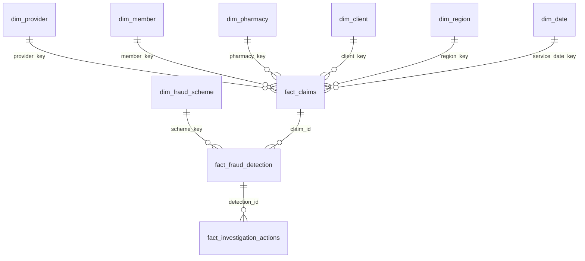

# Dimensional Model

## Grain Definitions

| Table | Grain |
|---|---|
| `fact_claims` | One prescription/professional claim line |
| `fact_fraud_detection` | One fraud detection event per entity, scheme, and detection date |
| `fact_investigation_actions` | One SIU action per investigation event |

## Surrogate Keys

Every dimension uses integer surrogate keys. Source identifiers such as NPI, member ID, NCPDP, and client code are retained as alternate/business keys.

## Slowly Changing Dimensions

- `dim_provider`: SCD Type 2 for specialty, network status, and address changes.
- `dim_member`: Type 2 for plan/client/region changes.
- `dim_pharmacy`: Type 2 for ownership and chain changes.
- `dim_client`: Type 1 for descriptive updates unless contractual history is required.

## Star Schema

