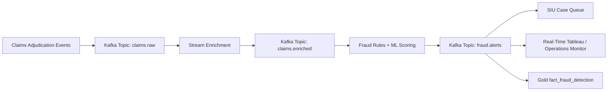

# Kafka Streaming Fraud Alert Architecture

## Example Streaming Patterns

- Duplicate claim within short time window
- Rapid claim submission bursts by provider or pharmacy
- Opioid fill velocity across multiple prescribers
- High-dollar outlier claim compared with provider peer group
- Geographic clustering by county and pharmacy chain
